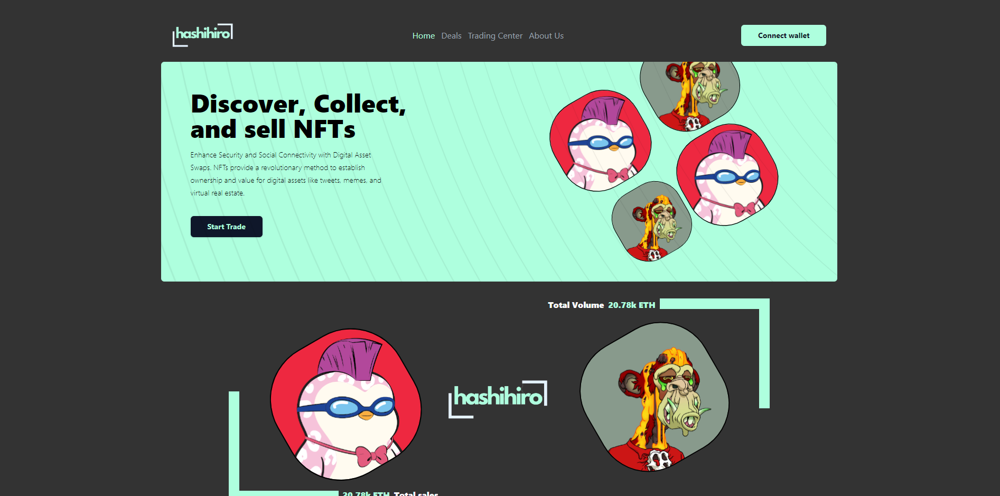

# Hashihiro NFT Marketplace

Hashihiro is a decentralized platform for discovering, collecting, and selling NFTs. It enhances security and social connectivity through digital asset swaps, offering users revolutionary ownership for virtual assets.

## Table of Contents
- [Features](#features)
- [Screenshots](#screenshots)
- [Technologies Used](#technologies-used)
- [Getting Started](#getting-started)
## Features

- **Buy, Sell, and Trade NFTs:** Seamlessly engage in NFT trades.
- **Secure Digital Asset Swaps:** Enhanced security for NFT transactions.
- **Cross-Blockchain Support:** Compatibility with multiple blockchains for flexibility in trading.
- **User Profiles:** View and engage with users on the platform.
- **Real-time Trading Center:** Track ongoing and completed NFT trades.

## Screenshots

### Home Page

### Deals Page

### Trading Center

## Technologies Used

- **Frontend:** HTML, CSS, JavaScript, React
- **Backend:** Node.js, Express
- **Blockchain:** Solidity, Web3.js, Ethereum
- **Database:** MongoDB
- **Smart Contracts:** ERC-721, ERC-1155

## Getting Started

### Prerequisites
- Node.js
- NPM or Yarn
- MetaMask wallet
- Ethereum Testnet (e.g., Rinkeby or Goerli)

